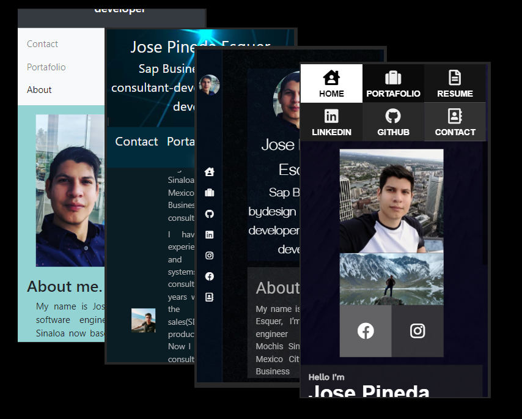
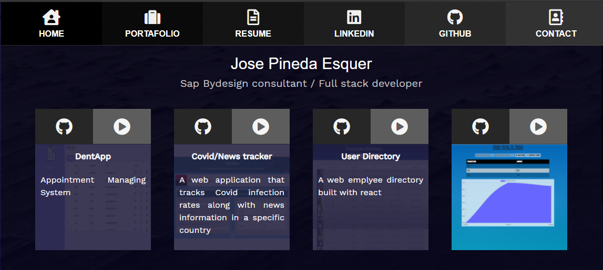

# Updated Portfolio Page

An updated version of my portafolio page using react.

## Portfolio Page URL

[Updated Portafolio](https://jpineda30.github.io/react-portafolio/)

## About the portafolio

This version of my portafolio uses react as a framework. The information about my resume and my proyects are stored in a json file that is imported by de elments to display the information in the adecuate place so any adition to the json automaticly updates the layout.

There is a menu element acting as a header with the routes for all the pages.

The portafolio is fully responsive so it can be displayed in a mobil device with a stylized layout.

For the styling i used *bulma*, *fontawesome* but mostly pure css and flex box to make the elements responsive..

## User info

[GitHub User: jpineda30](https://github.com/jpineda30)

In case of any doubt or clarification, contact me at:  
Email: jose.pinedaesquer@gmail.com